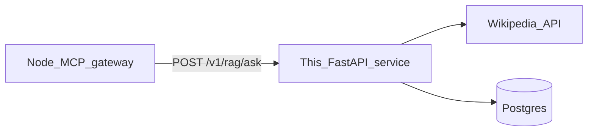

# Python RAG agent (split deploy)

Separate **web** service from the Node MCP app. Implements Wikipedia-backed retrieval, TF-IDF / truncated SVD scoring, and writes to the same Postgres tables as Prisma: `Question` and `CorpusEntry` (RagChunk).

## Flow



Prompt Opinion (or Cursor) talks **only** to the MCP URL. The MCP process must set `AGENT_RAG_URL` to this service’s public base URL (no trailing slash). MCP tools `ask_web_rag` and `ask_bank_rag` are delegated here when that env is set.

## Environment

| Variable | Required | Description |
|----------|----------|-------------|
| `DATABASE_URL` | Yes | Same Postgres as the Node app (Prisma). |
| `AGENT_RAG_SECRET` | Recommended | If set, every request must send header `X-Agent-Key: <same value>`. |
| `RAG_TOP_K` | No | Default `5`. |
| `WIKI_USER_AGENT` | No | Override default Wikimedia User-Agent. |

## Local run

From **repository root** (so imports resolve):

```bash
pip install -r agent/requirements.txt
set DATABASE_URL=postgresql://...
set AGENT_RAG_SECRET=dev-secret
python -m uvicorn agent.app.main:app --host 127.0.0.1 --port 8080
```

Example call:

```bash
curl -sS -X POST http://127.0.0.1:8080/v1/rag/ask ^
  -H "Content-Type: application/json" ^
  -H "X-Agent-Key: dev-secret" ^
  -d "{\"question\":\"What is pneumonia?\",\"refresh\":false}"
```

Bank question (slug must exist in `Question`, e.g. seeded `qb_001`):

```bash
curl -sS -X POST http://127.0.0.1:8080/v1/rag/bank ^
  -H "Content-Type: application/json" ^
  -H "X-Agent-Key: dev-secret" ^
  -d "{\"slug\":\"qb_001\",\"refresh\":false}"
```

## Response shape

JSON matches the Node `DynamicWebRagResult` fields used by MCP: `slug`, `question`, `embeddingProvider`, `webSource`, `indexedChunks`, `refreshed`, `topMatches` (each with `id`, `score`, `content`, `meta`, `createdAt`), `answerPreview`.

## Docker

See [`../Dockerfile.agent`](../Dockerfile.agent). Render: deploy as a second Web Service; set `AGENT_RAG_URL` on the **mcp-gateway** service to `https://<rag-agent>.onrender.com` and use the same `AGENT_RAG_SECRET` on both.
