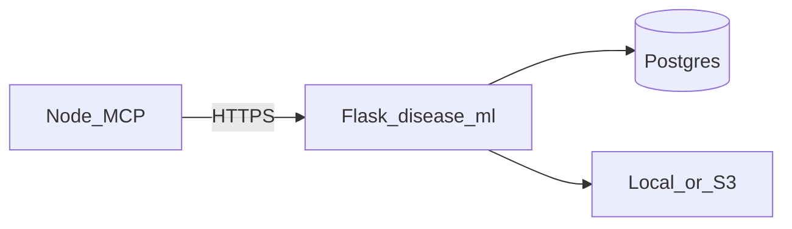

# Flask disease corpus ML sidecar

Hosting-aware REST API for **per-disease / per-functionality** corpus ingest (PDF text + image placeholders), **sklearn** training keyed by `formulaKey` in Postgres (`DiseaseFunctionalityConfig`), and text prediction. Same `DATABASE_URL` as Node/Prisma.

**Not for clinical decisions.**

## Per-disease `model.py` / `controller.py`

Generated under **`ml/diseases/<slug>/`** (from `ml/config/diseases.json`). Each disease exposes:

- `GET /v1/diseases/<slug>/corpus-spec` — JSON defaults (`DEFAULT_FORMULA_KEY`, `DEFAULT_FUNCTIONALITY`, etc.).

Regenerate after changing the config:

```bash
python ml/scripts/scaffold_disease_mvc.py
```

## Environment

| Variable | Purpose |
|----------|---------|
| `DATABASE_URL` | Postgres (required). Run Prisma migrations so `DiseaseTrainingAsset`, `DiseaseFunctionalityConfig`, `DiseaseTrainedModel` exist. |
| `DISEASE_ML_SECRET` | If set, clients must send header `X-Disease-Ml-Key` with the same value. |
| `DISEASE_ML_STORAGE` | `local` (default) or `s3`. |
| `DISEASE_ML_STORAGE_ROOT` | Local artifact root (default under repo `ml/artifacts/disease_ml`). On Render, point to a writable path (e.g. `/var/disease_ml`) — disk is still **ephemeral** unless you attach storage. |
| `DISEASE_ML_S3_BUCKET` | Required when `DISEASE_ML_STORAGE=s3` (plus standard AWS env vars). |
| `DISEASE_ML_S3_PREFIX` | Optional key prefix (default `disease-ml`). |
| `DISEASE_ML_MAX_ASSETS` | Max rows per `(diseaseSlug, functionality)` (default `100`). |
| `PORT` | Listen port (default `8090` in Docker). |

## Run locally

From repo root (so `.env` loads):

```bash
pip install -r ml/requirements-flask-disease.txt
cd ml/flask_disease
set DATABASE_URL=...   # Windows
python -m flask --app wsgi:app run --port 8090
```

Or: `gunicorn --bind 0.0.0.0:8090 wsgi:app`

## HTTP API

- `GET /health`
- `POST /v1/diseases/<slug>/assets` — multipart: `functionality` (optional), `trainingLabel` (optional 0/1), one or more `file` parts.
- `POST /v1/diseases/<slug>/train` — JSON `{ "functionality", "formulaKey?", "hyperparams?" }`
- `GET /v1/diseases/<slug>/models?functionality=...`
- `POST /v1/diseases/<slug>/predict` — JSON `{ "functionality", "text" }`

## MCP / Node

Set `DISEASE_ML_URL` (and optional `DISEASE_ML_SECRET`) on the Node MCP process to enable tools `disease_corpus_ml_*`.

## Demo seed

Migration `20260512140000_disease_corpus_ml` inserts `alzheimers` + `educational_triage_text` with `formulaKey=tfidf_lr`.

## Diagram


